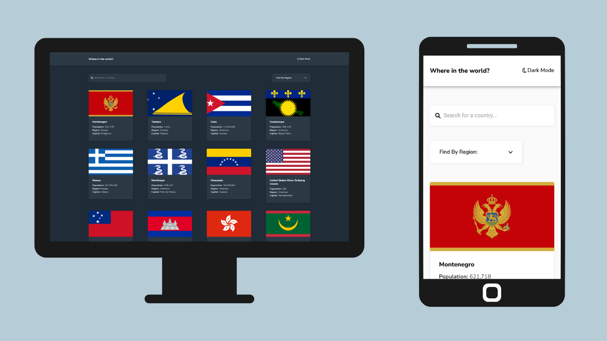

# Frontend Mentor - REST Countries API with color theme switcher solution

This is a solution to the [REST Countries API with color theme switcher challenge on Frontend Mentor](https://www.frontendmentor.io/challenges/rest-countries-api-with-color-theme-switcher-5cacc469fec04111f7b848ca). Frontend Mentor challenges help you improve your coding skills by building realistic projects. 

## Table of contents

- [Overview](#overview)
  - [The challenge](#the-challenge)
  - [Screenshot](#screenshot)
  - [Links](#links)
- [My process](#my-process)
  - [Built with](#built-with)
  - [What I learned](#what-i-learned)
  - [Continued development](#continued-development)
  - [Useful resources](#useful-resources)
- [Author](#author)
- [How to run this project](#how-to-run-this-project)

## Overview

### The challenge

Users should be able to:

- See all countries from the API on the homepage
- Search for a country using an `input` field
- Filter countries by region
- Click on a country to see more detailed information on a separate page
- Click through to the border countries on the detail page
- Toggle the color scheme between light and dark mode *(optional)*

### Screenshot



### Links

- Solution URL: [Github repository](https://github.com/vanribeiro/know-more-about-countries-app)
- Live Site URL: [App](http://know-more-about-countries-app.vercel.app/)

## My process

### Built with

- Semantic HTML5 markup
- CSS:
  - Flexbox
  - CSS Grid
  - Media Queries
  - Keyframes
- JS:
  - Fetch API
  - Abort Controller
  - DOM API
  - Destructuring Assignment
- Mobile-first workflow
- Responsive Web Design
- Libraries and Packages JavaScript:
  - [React (Hooks)](https://reactjs.org/):
  - [React Router DOM](https://reactrouter.com/docs/en/v6/getting-started/overview)
  - [Styled Components](https://styled-components.com/)
  - [Material UI Components](https://mui.com/)

### What I learned

I started this challenge just not only to learn on *hands on*(my favorite way to learn new technologies and techeis) but to practice somethings that I learned in a courses track called ["Formação React"](https://www.alura.com.br/formacao-react-js). (If you wanna know more about it, [click here](https://www.alura.com.br/formacao-react-js)).

On this Courses Track, I learned things like:
- Class Components
- Function Components
- Hooks
- And something about React Ecosystem:
  - React Router DOM
  - Styled Components
  - Jest and React Test Library

Then, I tried to use as much as possible the topics above in this challenge to practice and consolidate my knowledge about React JS.

#### Clean up Function

I learned nice things about to use fetch API to get Restful API data and how important it's to clean up `useEffect` to avoid `memory leaks`.  After I wrote the `fetchCountry()` function, when I was trying to surffer up to home page, I always received a warning in console like:

> Warning: Can't perform a React state update on an unmounted component. This is a no-op, but it indicates a memory leak in your application. To fix, cancel all subscriptions and asynchronous tasks in a useEffect cleanup function.

And I never understood why this was happening. After sometime looking for a solution, I discovery this was happen because I was using some props inside `useEffect` and just to pass it inside brackets dependencies wasn't sufficient. I needed to clean up it correctly. [This post](https://academind.com/tutorials/useeffect-abort-http-requests) was really useful to me on that moment.

The problem was happing because when I was going to home page, the Details Page was on unmount life cycle. The solution recommended by the post author was use a clean up function using the `signal` property of `Abort Controller` to know when to cancel the Http request and this stopped the error.

```js

  useEffect(() => {
    
    const controller = new AbortController();

    let timer = setTimeout(() => {
      fetchCountryDetails(id, setCountryInfo, setError, setIsLoading);
    }, 2000);

    return () => {
      controller.abort();
      clearTimeout(timer);
    };

  }, [id]);

```

### Continued development

#### About Front-End Tests

I finished this challenge, but I want to write somes tests to understand more about this topic and improve the quality of my code.

#### NextJS
After write some tests, I wanto to convert this project from `Create React App` to `NextJS Framework` and to know more about the framework.

### Useful resources

- [Making Http Requests with React useEffect - Correctly](https://academind.com/tutorials/useeffect-abort-http-requests) - This is an amazing article which helped me finally understand and helped me to write HTTP Request in a nice way, without memory leaks and using Hooks. I really liked this pattern and will use it going forward.
- [O que significa %20 e %30 em URL?](https://pt.quora.com/O-que-significa-20-e-30-em-URL) -  Up to this challenge, I didn't know anything about `HTML URL Encoding`. Searching on Google, I discovery this Question/Answer wich was really useful to understand which chracacteres should be use to compose an URL. I'd recommend who uses SPA to learn a little about it.
- [Comunicação entre componentes no React](https://medium.com/luizalabs/comunica%C3%A7%C3%A3o-entre-componentes-no-react-6b42aac62321) -  This post was really useful to me about to understand how to send props from `child` to `parent` component, without using Context API. The Context API It's a really nice thing, but I didn't like it to use to pass value from input using `change` listener. I thought the typing really slow.

## Author

- Website - [Van Ribeiro](https://vanribeiro.github.io/)
- Frontend Mentor - [@vanribeiro](https://www.frontendmentor.io/profile/vanribeiro)
- Twitter - [@vanribeirodev](https://www.twitter.com/vanribeirodev)
- Instagram - [@vanribeirodev](https://www.instagram.com/vanribeirodev)

## How to run this project?

If you wanna run this project locally, please fork or clone this project:

```shell
git clone https://github.com/vanribeiro/know-more-about-countries-app.git
```

Go to the `app/` folder:

```shell
cd app/
```

Inside `app/` folder, install all projects dependencies:

```shell
npm install
```

When the download is finish, in the same folder, run it to see the project:

```shell
npm start
```

The browser should open a tab in the address similar like:
```
http://localhost:3000/
```